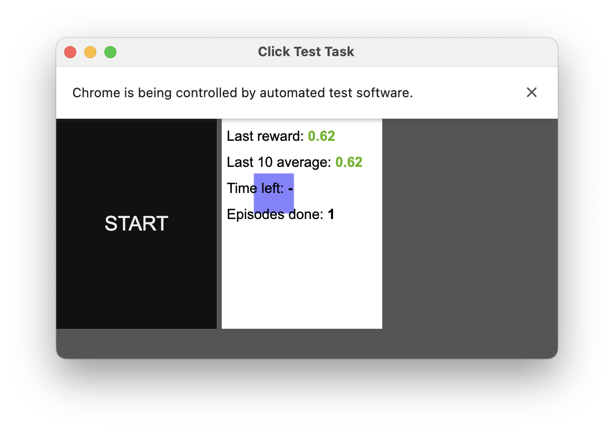
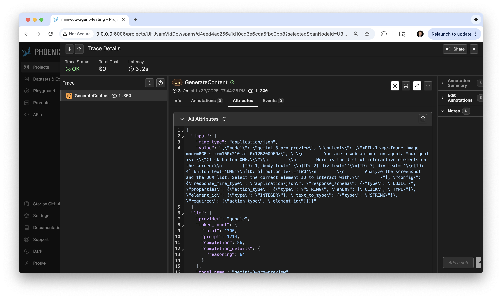

# Gemini 3 on MiniWoB++ Benchmark

This repository contains an agent loop to benchmark **Google Gemini 3** (specifically `gemini-3-pro-preview`) on the **MiniWoB++** dataset. It uses the Gemini API to process web page screenshots and DOM trees, translating natural language instructions into concrete web actions (clicking, typing) via Selenium and Gymnasium.

## Features
*   **Gymnasium Integration:** Wraps MiniWoB++ environments for standard `reset()`/`step()` interaction.
*   **Multimodal Agent:** Uses Gemini 3's vision capabilities to analyze the UI state.
*   **Structured Output:** Enforces JSON schema on Gemini responses for reliable action parsing.
*   **Modern Tooling:** Built with `uv` for fast dependency management.

## Prerequisites
*   **Python:** 3.10 - 3.12 (Managed automatically by `uv`)
*   **Browser:** Google Chrome or Chromium installed locally.
*   **API Access:** A Google Cloud Project with the Gemini API enabled.

## Installation

This project uses [uv](https://github.com/astral-sh/uv) for dependency management.

1.  **Clone and Initialize:**
    ```bash
    # Clone repo (or create directory)
    mkdir gemini-miniwob-agent
    cd gemini-miniwob-agent

    # Initialize uv
    uv init
    uv python pin 3.12
    ```

2.  **Install Dependencies:**
    ```bash
    uv add gymnasium miniwob google-genai pillow numpy selenium webdriver-manager python-dotenv arize-phoenix opentelemetry-instrumentation-google-genai
    ```

## Configuration

1.  Create a `.env` file in the root directory:
    ```bash
    touch .env
    ```

2.  Add your credentials and model configuration:
    ```ini
    # .env
    GEMINI_API_KEY=AIzaSy...YOUR_API_KEY
    MODEL_NAME=gemini-3-pro-preview
    
    # Optional: Set to 'human' to watch the browser, or 'rgb_array' for headless
    RENDER_MODE=human
    ```

3.  Ensure `.env` is listed in your `.gitignore`:
    ```text
    .env
    .venv/
    __pycache__/
    *.log
    ```

## Usage

### Run Server

Before running the agent, start a local MiniWoB++ server to host the tasks:

```bash
uv run -m miniwob.server --port 8000
```

### Run Phoenix Server

```bash
uv run phoenix serve
```


### Execute

To run the evaluation loop on a specific MiniWoB task (e.g., `click-test-2`), execute the main script using `uv`:

```bash
uv run main.py

--- Starting Evaluation for miniwob/click-test-2-v1 ---
Episode 1/3 | Goal: Click button ONE.
  Gemini Action: {'action_type': 'CLICK', 'element_id': 4}
  > SUCCESS!
Episode 2/3 | Goal: Click button ONE.
  Gemini Action: {'action_type': 'CLICK', 'element_id': 4}
  > SUCCESS!
```

You should see the agent interacting with the MiniWoB environment via browser:



This will also run Arize Phoenix as you should see `🌍 Phoenix App: http://localhost:6006`



### Modify tasks

To modify, change the task name in `main.py`:

```python
# very hard critical reasoning task
run_eval('miniwob/email-inbox-v1', episodes=3)
```

### DOM: Bottleneck and Improvements

In the `agent.py` file, the DOM simplification logic has been updated to safely handle missing `hidden` attributes:

```python
        # Simplify DOM for the LLM (token efficiency)
        # We only send interactive elements with their reference IDs
        simplified_dom = [
            f"[ID: {el['ref']}] {el['tag']} text='{el.get('text', '')}'" 
            for el in dom_elements 
            # Safely check for 'hidden', default to False if missing
            if not el.get('hidden', False)
        ]
```

However, this is simplified for token efficiency.

Alternative DOM parsing strategies can be implemented in `agent.py` as needed, e.g., sending more context or different attributes.

For performance, **the bottleneck is usually "Grounding" (linking the visual element to the DOM ID).**

#### The "Grounding" Problem
Imagine the screen has two identical "Submit" buttons (one at the top, one at the bottom).

1.  **The Image:** Gemini sees two buttons.
2.  **The DOM List:** You send:
    ```text
    [ID: 4] button text='Submit'
    [ID: 9] button text='Submit'
    ```
3.  **The Disconnect:** Gemini sees the pixels, and it reads the text list, but **it has no way to know** that `ID: 4` is the top button and `ID: 9` is the bottom button. The text list lacks *spatial* information.

#### How to Improve Performance (Experiments)

Here are the three levels of providing DOM context, ranging from "Basic" (what you have) to "State of the Art."

#### Level 1: Basic (Current)
You send the Tag + Text.
*   *Pros:* Cheap, low token usage.
*   *Cons:* Fails when elements look similar or positioning matters (e.g., "Click the button on the right").

#### Level 2: Coordinate-Enriched DOM (Low Hanging Fruit)
MiniWoB elements usually contain `left`, `top`, `width`, and `height`. You can inject this into the text prompt so Gemini can correlate the pixels (Vision) with the math (Text).

**Modification to `agent.py`:**
```python
# In get_action...

simplified_dom = []
for el in dom_elements:
    if el.get('hidden', False):
        continue
    
    # Extract coordinates if available (MiniWoB usually provides these)
    # specific keys might vary, usually 'left', 'top', or 'classes'
    # You might need to print 'el' to see exactly what keys exist.
    
    # Let's assume 'left' and 'top' exist in the raw element dict:
    coords = f"(x={el.get('left', 0)}, y={el.get('top', 0)})"
    
    entry = f"[ID: {el['ref']}] {el['tag']} text='{el.get('text', '')}' loc={coords}"
    simplified_dom.append(entry)

# Result sent to Gemini:
# [ID: 4] button text='Submit' loc=(x=10, y=20)
# [ID: 9] button text='Submit' loc=(x=10, y=500)
```
*Now Gemini can reason: "The instruction says click the bottom button. y=500 is greater than y=20. Therefore, ID 9."*

#### Level 3: Visual Tagging (Set-of-Mark) - The "Pro" Move
This is currently the most effective technique for Web Agents. Instead of asking the model to guess which ID matches the image, **you draw the ID on the screenshot** before sending it.

1.  **Python Logic:**
    *   Iterate through `dom_elements`.
    *   Get `left`, `top`, `width`, `height`.
    *   Use `PIL.ImageDraw` to draw a red bounding box and the number `4` over the button in the screenshot.
2.  **Send to Gemini:**
    *   The Modified Screenshot (with numbers painted on it).
    *   The Prompt: "Click the element labeled 4."

This removes the ambiguity entirely. Gemini doesn't need to guess the mapping; it just reads the number painted on the pixels.

####  Summary
If you want to benchmark "how good is Gemini 3 at raw web understanding," stick to **Level 2 (Coordinates)**.

If you want to build the "highest success rate agent possible," you should implement **Level 3 (Visual Tagging)**.

### Project Structure

*   **`main.py`**: The entry point. Initializes the environment, runs the loop, and tracks success rates.
*   **`agent.py`**: Handles the Gemini API connection. Constructs the prompt (Screenshot + simplified DOM) and parses the JSON response.
*   **`environment.py`**: A wrapper around the MiniWoB Gymnasium environment to translate high-level agent intents (JSON) into low-level Selenium actions.
*   **`utils.py`**: (Optional) Helper functions for DOM parsing and logging.

## Technical Notes

*   **Latency:** Large multimodal models may have inference times of 1-3 seconds. Ensure the MiniWoB environment timeout is adjusted if tasks fail due to time constraints.
*   **DOM Parsing:** The agent simplifies the raw DOM tree to save context window space, sending only interactive elements (buttons, inputs) to the model.
*   **Action Space:** The agent currently supports `CLICK_ELEMENT` (via ID reference) and `TYPE_TEXT`. Coordinate-based clicking is disabled to improve reliability.